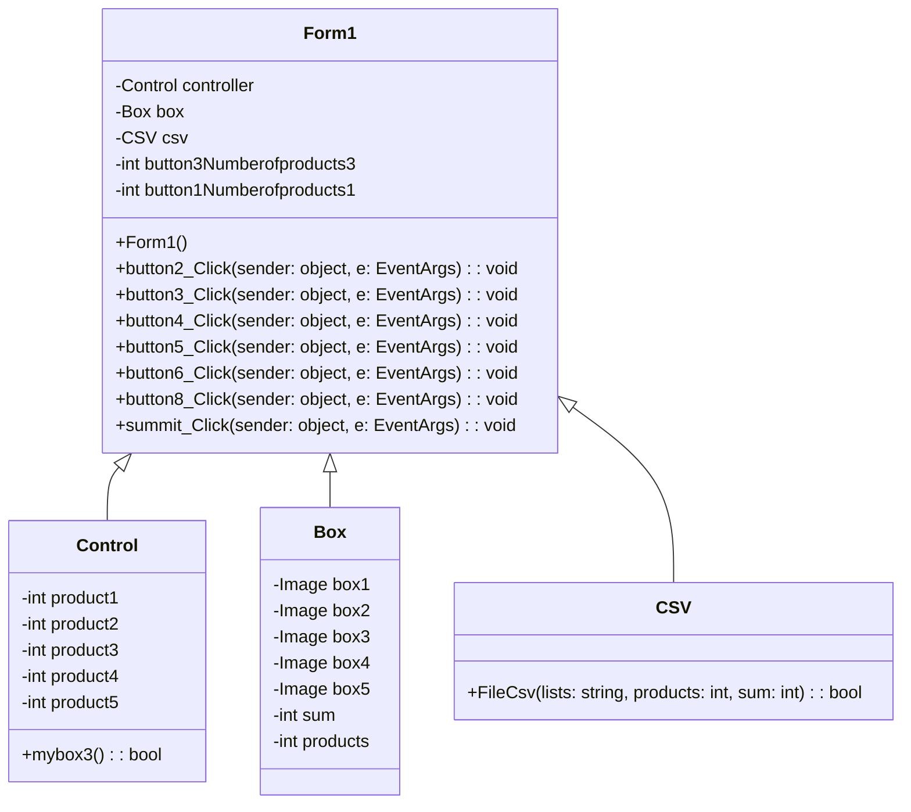

1.ความเป็นมาของโปรแกรม  
 เนื่องจากเห็นระบบของตู้เซเว่น จึงอยากทำตู้กล่องสุ่มที่คล้ายๆระบบของเซเว่นเพื่อจำหน่ายในห้างสรรพสินค้า ในจังหวัดต่างๆ

2.วัตถุประสงค์ของโปรแกรม
ทำโปรแกรมตู้กล่องสุ่ม

3.โครงสร้างของโปรแกรม (Class diagram) ของโปรแกรม ใช้ Mermaid ในการเขียน ตัวอย่าง การเขียน Classdiagram ใน Markdown

4.ชื่อของผู้พัฒนาโปรแกรม  นางสาวจุฑาทิพย์ ภูบุญลอด รหัสนักศึกษา 663450036-3
